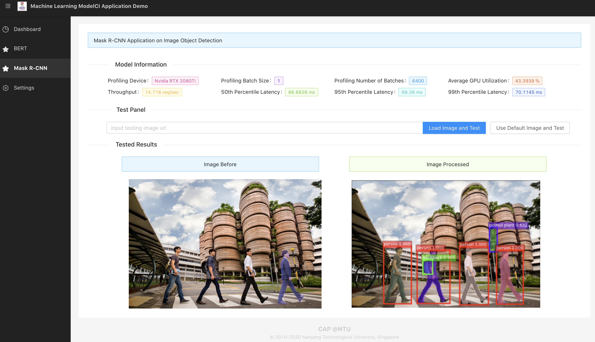

# Application Demo of ML Model CI

Sample applications that can be served and profiled by [ML Model CI](https://github.com/cap-ntu/ML-Model-CI).

The web application contains two parts (tabs):

- BERT Application on Descriptive Text Sentiment Analysis
- Mask R-CNN Application on Image Object Detection

## Quick Start

### Download Model

Click the following links to download the models.

- [BERT](https://github.com/tensorflow/models/tree/master/official/nlp/bert), [IMDB Dataset](https://keras.io/api/datasets/imdb/)
- [Mask R-CNN](http://download.tensorflow.org/models/object_detection/mask_rcnn_resnet101_atrous_coco_2018_01_28.tar.gz).

### Serve Model by ModelCI

You can build a script to start the server or using command line tool.

#### Build a Script to Start

Please refer to the [ModelCI doc](https://github.com/cap-ntu/ML-Model-CI#retrieve-model-and-deploy). 

#### Using Script to Start

By using the [serve.py](https://github.com/cap-ntu/ML-Model-CI/blob/master/modelci/hub/deployer/serving.py) in ModelCI, we can start the inference server easily, but you need to [register the model](https://github.com/cap-ntu/ML-Model-CI#register-a-saved-model) first.  

```bash
python serving.py name --m MRCNN -f tensorflow -e tfs --device cuda:1
```
The same as BERT model. 

### Connect to the Web Application

You need to modify the API address in the application source code, to start the services.

Address location:

- [BERT](https://github.com/cap-ntu/mlmodelci_mm_demo/blob/b1509b56f55e8c6ce3fb262e237a82655ed3e1e4/src/pages/BERT/index.tsx#L72)
- [Mask R-CNN](https://github.com/cap-ntu/mlmodelci_mm_demo/blob/master/src/pages/MRCNN/index.tsx)

After all of these, you can start the web application to see the serving and inference results by:

```bash
npm install
npm start
```

## Screenshots

|BERT Application on Descriptive Text Sentiment Analysis|Mask R-CNN Application on Image Object Detection|
|:--:|:--:|
|||

For more details about the [screenshots](./screenshots).


